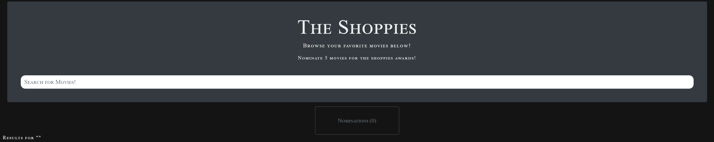
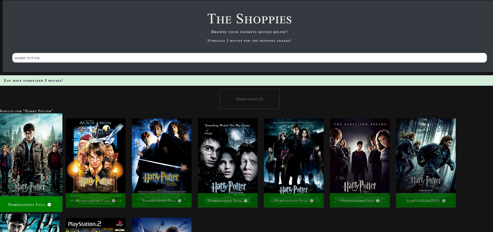
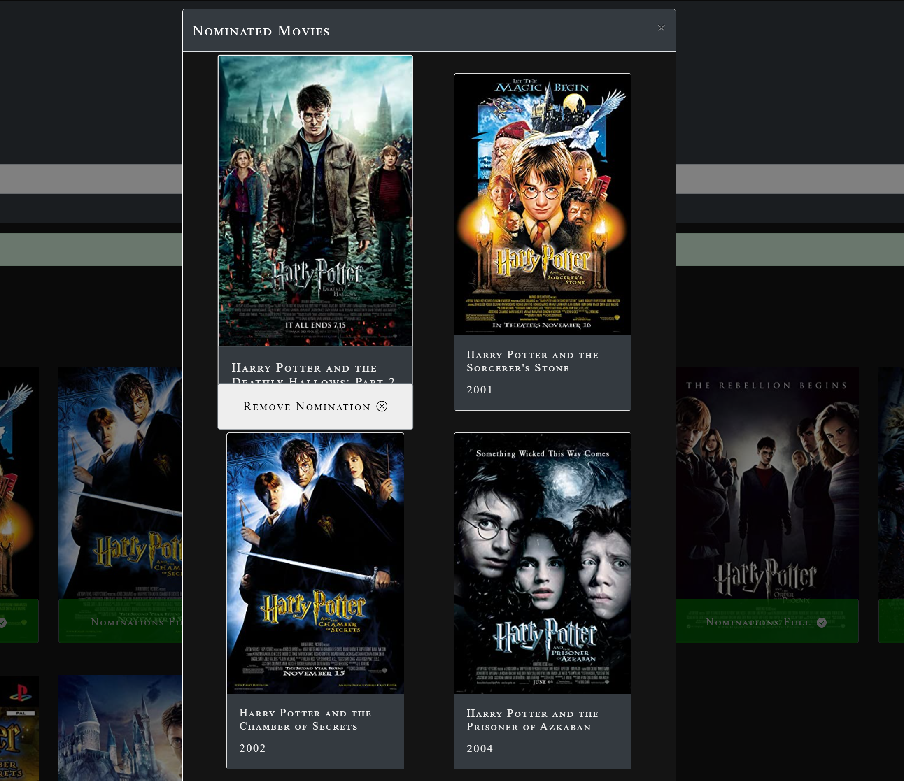

# The Shoppies
  
   
  

  ## Description

  Nominate 5 of your favorite movies for the upcoming shoppie awards! 

  Checkout the deployed project [here](https://theshoppies-mo.herokuapp.com)

  
  
  
  
  
  ## Table of Contents
  * [Installation](#installation)
  * [Usage](#usage)
  * [Technology](#technology)
  * [Contribution](#contribution)
  * [License](#license)
  ## Installation
  
  If you wish to contribute to the project, clone the repo and run npm install. It will install all the dependencies as well as the react app
  
  
  ## Usage
  
  Search for a movie and click the nominate button to add it to your nominations. When your nominations list hits 5 movies, an achievment banner will display exclaming you achieve 5 nominations. Once that happens, all nominate buttons will disable and you cannot nominate any more movies. To view your nominations, click the nominations button. From there you will be able to remove any nominations.

  ## Technology

  Utilized: HTML, CSS, JavaScript, ReactJs, LocalStorage, omdb API, Bootstrap.
  
  
  ## Contribution
  
  Anyone may contribute to this project to improve on the functionality and code quality.
  
  
  ## License
  
  MIT License
  
  
  ## Questions?
  
  If you have any questions, please contact me with the information below:

  Github [@oballematt](https://github.com/oballematt)